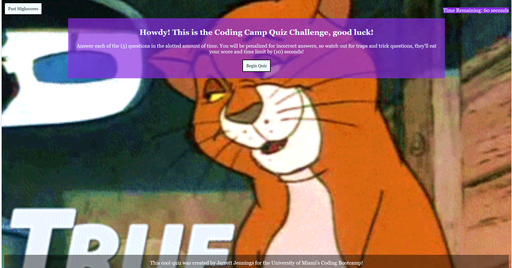
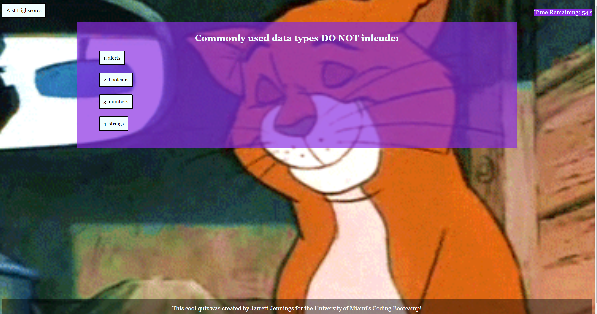
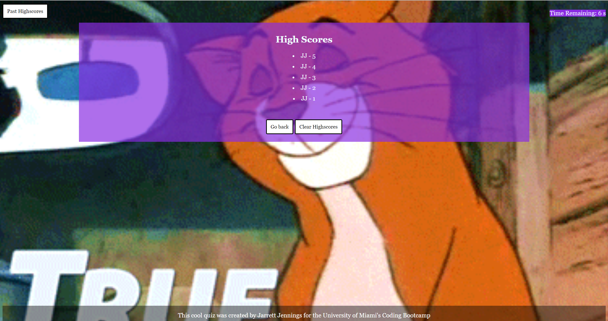

# codingquiz
This is the repo for Coding Bootcamp Challenge #3 (Coding Quiz Challenge).

# codingquiz
This is the repo for Coding Bootcamp Challenge #3 (Coding Quiz Challenge).

## Description
This project entailed combining written HTML, CSS, and JavaScript to create a timed multiple choice quiz that saved the top 5 highest scores.

## Usage:
As a coding boot camp student, I want to take a timed quiz on JavaScript fundamentals that stores high scores, so that I can gauge my progress compared to my peers. Given that I am taking a code quiz, when I click the start button, then a timer starts and I am presented with a question. When I answer a question, then I am presented with another question. When I answer a question incorrectly, then time is subtracted from the clock. When all questions are answered or the timer reaches 0, then the game is over. When the game is over, then I can save my initials and my score.

### Desktop Screen

### Smaller Screen

### Quiz Questions
 

 

### Submit Page

### High Score Page

## Link to deployed webpage: 
https://codingjarrett.github.io/codingquiz/

## License
Please refer to the GitHub Repository for licensing information. Link to GitHub repository: https://github.com/codingjarrett/codingquiz
